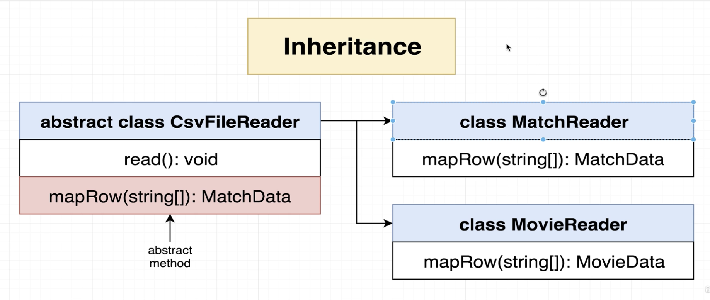
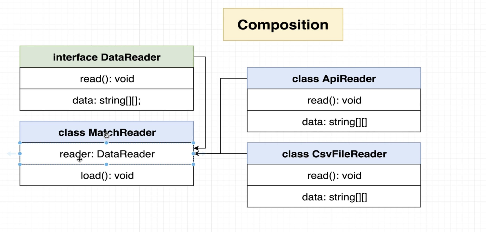

# Install types for Node Js Standard Lib (fs, http, os)

- npm install @types/node

# Enums

- Follow near-identical syntax rules as normal objects
- Create an object with the same keys and values when converted from TS to JS
- Primary goal is to signal to other engineers that these are all closely related values
- Use whenever we have a small fixed set of values that are all closely related and known at compile time.

```
enum MatchResult {
    HomeWin = "H",
    AwayWins = "A",
    Draw = "D",
}

const printMatchResult = (): MatchResult => {
    if (match[5] === "H") {
        return MatchResult.HomeWin;
    }
    return MatchResult.AwayWins;
};
```

# Type Assertion

- Type assertion is a way to tell the computer "I know what type this variable is." It helps when the computer can't figure out the type on its own.

For example, if you have a variable that can be any type, like this:

```
let value: any = "hello";
```

You know it's a string, but the computer doesn't. You can use type assertion to tell the computer it's a string:

```
let length: number = (value as string).length;
```

# Generics

- Like function arguments, but for types in class/function definitions
- Allows us to define the type of a property/ arguments/return value at a future point
- Used heavily when writing reusable code

```
class HoldAnything<TypeOfData>{
    data: TypeOfData;
}

const holdNumber= new HoldAnything<number>();
holdNumber.data=123;

const holdString= new HoldAnything<string>();
holdString.data="abc";
```

# Inheritance Vs Composition

- Inheritance is characterized by an relationship between two classes.
  

- Composition is characterized by a has a relationship between two classes.
  

Inheritance vs Compostion based approach

<!--  -->

1.  
2.  
3.  
4.  
5.  
<!--  -->
6.  
7.  
<!--  -->
8.  

```
// Define the Openable mix-in
const Openable = (Base) => class extends Base {
  constructor(...args) {
    super(...args);
    this.open = false;
  }
  toggleOpen() {
    this.open = !this.open;
  }
};

// Define the Rectangular mix-in
const Rectangular = (Base) => class extends Base {
  constructor(height, width, ...args) {
    super(...args);
    this.height = height;
    this.width = width;
  }
  area() {
    return this.height * this.width;
  }
};

// Base class to apply mix-ins
class Base {}

// Apply the mix-ins to create the RectangleWindow class
class RectangleWindow extends Openable(Rectangular(Base)) {
  constructor(height, width) {
    super(height, width);
  }
}

// Create an instance of RectangleWindow
const myWindow = new RectangleWindow(10, 20);

// Use the methods
console.log(`Area: ${myWindow.area()}`); // Area: 200
console.log(`Is open: ${myWindow.open}`); // Is open: false
myWindow.toggleOpen();
console.log(`Is open: ${myWindow.open}`); // Is open: true
```

<!--  -->

9. Composition based approach
   
