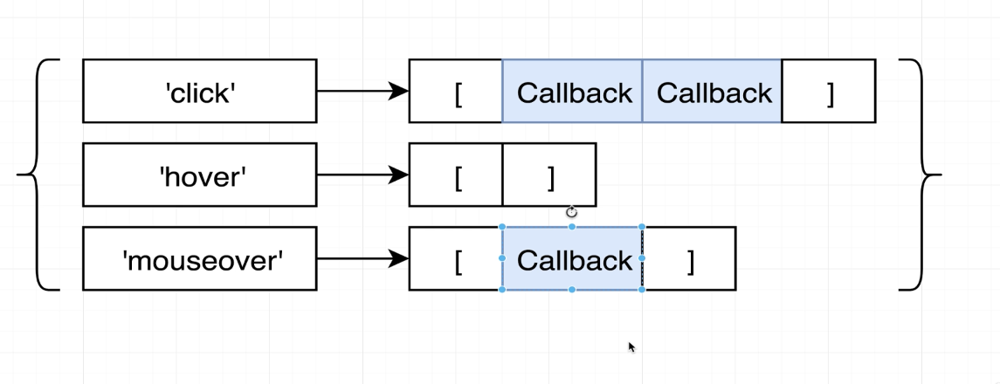
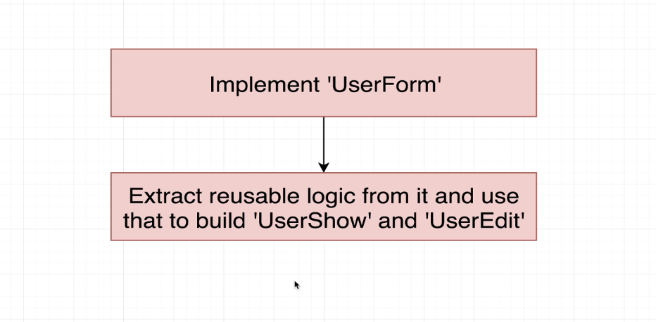
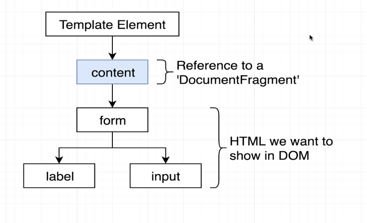

# Notes

- To build the app and run the development server, simply run the following command in your terminal:
  npx parcel index.html
- Also, make sure to add type="module" to the script tag of your index.html
  

# Web Framework Structure

# Using typescript in for assigning types to key value pair in object

type Callback = () => void;

interface Event {
[key:string]: Callback[];
}

# Small Update for JSON server and Parcel Start Script

- In the upcoming lecture, we will be installing our JSON server globally. It would actually be a better idea to
  install this locally to our web project:
  npm install json-server@0
  npx json-server --watch db.json

- Note - We are installing the latest version less than 1.0 as all 1.0+ versions are currently very broken.
  Additionally, we need to make one small change to our scripts in the package.json file. Now that we are using npx to run Parcel, our command should instead be the following:
  "start:parcel": "npx parcel index.html"

# Two Important Rules

- In Typescript, string can be types
  type Monday='monday'
- In JS(and therefore TS), all object keys are string.

# '!' in TS (Strict Null Check)

- use '!' to tell TS that you're sure that the element is not null
