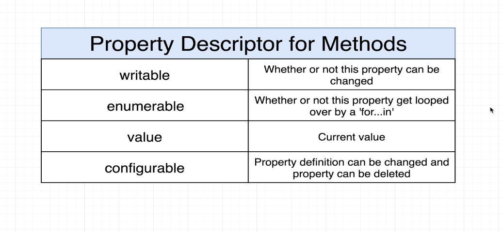

# Language and Environment

- Set the JavaScript language version for emitted JavaScript and include compatible library declarations
  "target": "es5"

# Decorators

- Function that can be used to modify/change/anything
  different properties/methods in the class.
- Not the same as javascript decorators
- Used inside/on classes only
- Understanding the order in which decorators are ran are the key to understand them
- Experimental

# Decorators on a property, method, accessor

- First argument is the prototype of the object
- Second argument is the key of the property/method/accessor on the object
- Third argument is the property descriptor
- Decorators are applied when the code for this class is ran (not when an instance is created)
- A decorator is executed when a class or class member is defined, not when an instance is created.

# Property Descriptor for Methods

